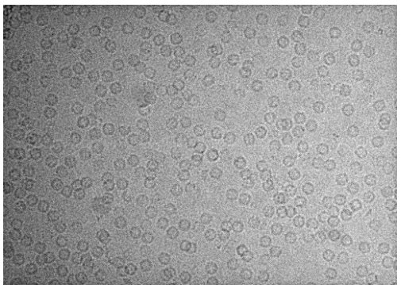
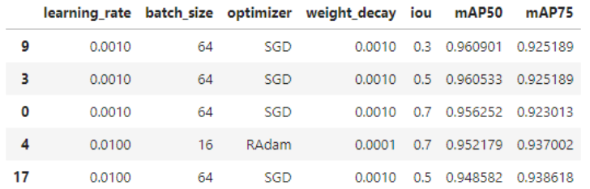
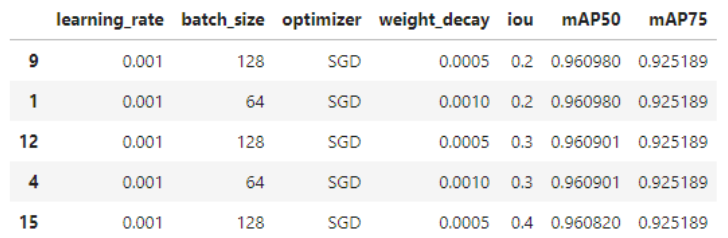
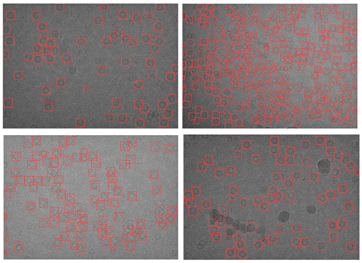

# apoferritin_object_detector

This notebook utilizes the 'yolov8m.pt' model as a starting point to initialize and train an object detector using YOLOv8 from Ultralytics. The objective is to identify instances of the apoferritin protein complex in cryo-EM data (see below) for single particle reconstruction.

The notebook begins by loading the 'yolov8m.pt' model, which serves as a pre-trained model with weights learned from a large dataset. The necessary hyperparameters for the Yolov8 model are configured. These hyperparameters include; learning rate, batch size, optimizer choice, weight decay, and intersection over union (IOU) threshold. Initially the hyperparameters are tuned using a randomised approach in order to home in on hyperparamter values which optimise the model to accurately detect the target protein complex (see table below).

To enhance the models accuracy further, a grid based hyperparameter optimisation was applied to tried which gave a slight improvement in the mAP50 metric (see below) showing the model was already well optimised for this function.

The resulting mAP50 of 0.961 and mAP75 of 0.925 demonstrate the high accuracy of the model in successfully detecting instances of the apoferritin protein complex within the cryo-EM data (see below)

